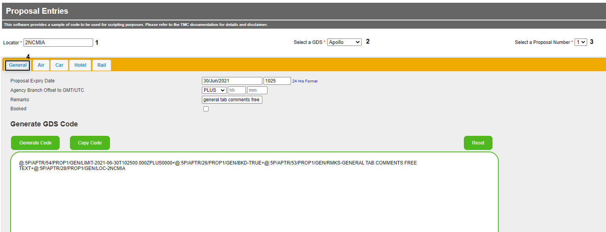
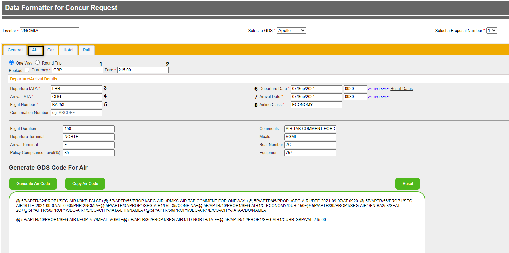
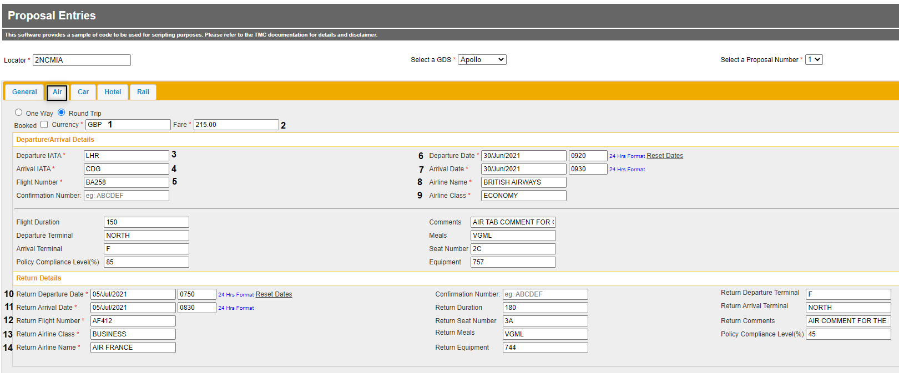
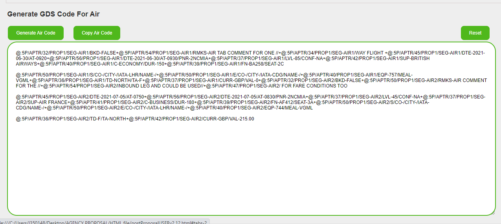
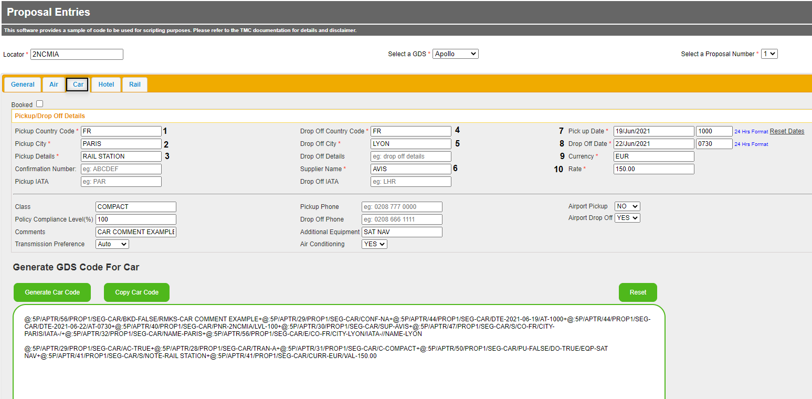
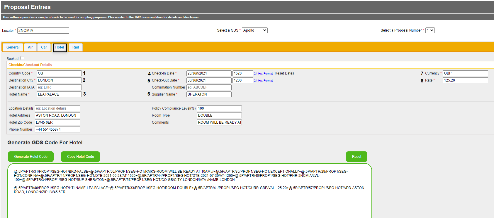
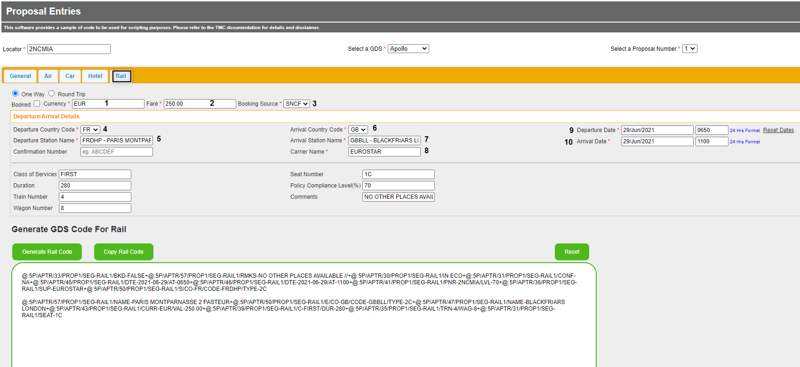
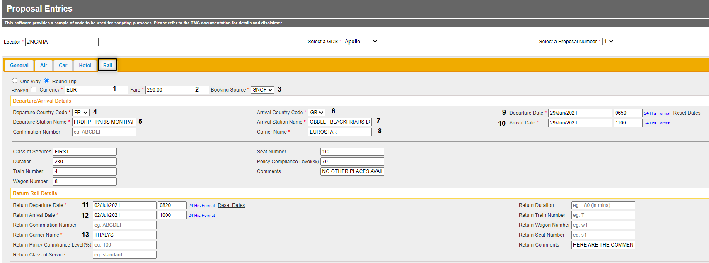
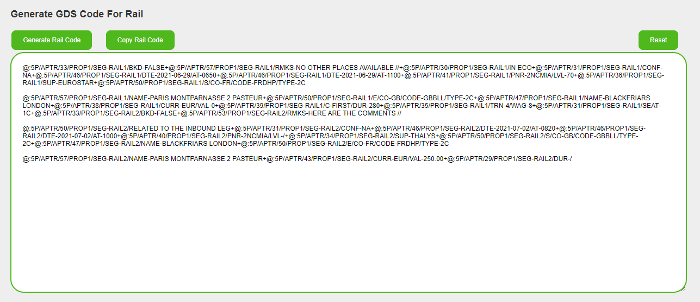

<h1 align="center">Data Formatter for Concur Request</h1>

This file has been created to assist TMCs with documenting proposals
back to a GDS Container PNR as part of the Agency Proposal Powered by
Compleat flow.

This file will ensure accuracy when entering the remark lines into the
GDS Container PNR and help provide all the mandatory elements to Travel
Request

# CONFIGURATION

The “Data Formatter for Concur Request” file has been programmed to
perform a concatenation of the remarks generated to allow for more than
one remark line to be copied at a time.

**The remarks order must be respected in order to have a successful PNR
transmission to Request.**

The configuration for the concatenation varies depending on the tool
used to interact with the GDS and the GDS itself. We have therefore
allowed for updates to the concatenation character and the number of
instances in the output block.

For more information on concatenation use and output examples, please
see the [Concatenation](#concatenation) section below.

Prior to implementation, please determine the correct character and
instances for your tool and GDS.

To edit the character and instances:

-   Save the file

-   Right click the file, and “open with” any document editor.

You will see the following at the beginning of the document:

/\*\*\*\*\*\*\*\*\*\*\*\*\*\*\*\*\*\*\*\*\* Concatenation Variables
\*\*\*\*\*\*\*\*\*\*\*\*\*\*\*\*\*\*\*\*\*\*\*/

// Concatenation Characters for each gds

concatStringApollo = "+"

concatStringAmadeus = ";"

concatStringGalileo = "+"

concatStringSabre = "&"

concatStringWorldspan = "#"

// Number of Concatenations for each Gds

lineLimitApollo = 8

lineLimitAmadeus = 8

lineLimitGalileo = 28

lineLimitSabre = 79

lineLimitWorldspan = 80

-   To update the character, amend the concatString value inside " "

-   To amend the number of concatenation instances, amend the lineLimit
    value after =\[space\]

-   Save the changes

-   Test the output against your GDS interaction tool, ensuring that the
    maximum value of instances is achieved

# GENERAL TAB 

This tab is used to add mandatory information remarks to the GDS
Container PNR.

This will be the landing page when the file is opened.

N.B. This document uses Apollo remark examples only.

## General Tab completion flow

## General Tab screenshot example

This step must be performed for each proposal before adding the related
segment remark data into the PNR.

## General Tab table of definitions

### General Tab mandatory information

<table>
<colgroup>
<col style="width: 50%" />
<col style="width: 21%" />
<col style="width: 28%" />
</colgroup>
<thead>
<tr class="header">
<th>
File input

and description
</th>
<th>PNR Remark label</th>
<th>PNR Remark example</th>
</tr>
</thead>
<tbody>
<tr class="odd">
<td>
(1) Locator

This is the record locator of the container PNR that the customer will use in any communication.

It can be either the GDS Container PNR locator or the locator of an additional booking.
</td>
<td>LOC-</td>
<td>LOC-2NCMIA</td>
</tr>
<tr class="even">
<td>
(2) Select a GDS

This is where you choose the GDS (in our example Apollo) needed to generate the Container PNR.
</td>
<td>Drop down choice on file</td>
<td>@:5P/APTR…</td>
</tr>
<tr class="odd">
<td>
(3) Select a Proposal Number

This is where you select the proposal number (3 is the maximum).

Each proposal must be entered in turn. After each is completed (and copied and pasted) the data for the next proposal can be updated.
</td>
<td>PROP1</td>
<td>@:5P/APTR/54/PROP1/…</td>
</tr>
<tr class="even">
<td>
(4) General

This tab is used to fill in the general information that is needed for the GDS Container PNR.
</td>
<td>GEN</td>
<td>@:5P/APTR/54/PROP1/GEN/…</td>
</tr>
</tbody>
</table>

### 

***  
***

### General Tab optional information

<table>
<colgroup>
<col style="width: 54%" />
<col style="width: 19%" />
<col style="width: 25%" />
</colgroup>
<thead>
<tr class="header">
<th>
File input

and description
</th>
<th>PNR Remark label</th>
<th>
PNR Remark example

with default values
</th>
</tr>
</thead>
<tbody>
<tr class="odd">
<td>
Proposal Expiry Date

This is the expiry date and time of the proposal.

<ul>
<li>
Date is in the format DD/MMM/YYYY
</li>
<li>
Time is in the format HHMM and is 24 hours
</li>
</ul></td>
<td>
LIMIT-

T-
</td>
<td>
LIMIT-2021-06-30

T102500.000

(shows as LIMIT-/ if blank)
</td>
</tr>
<tr class="even">
<td>
Agency Branch Offset to GMT/UTC

This is the agency branch time zone.

This works in conjunction with the Proposal Expiry so that the correct time can be applied adjusting any offset.

Select if the Offset is MINUS or PLUS GMT/UTC

<ul>
<li>
Date is in the format DD/MMM/YYYY
</li>
<li>
Time is in the format HHMM and is 24 hours
</li>
</ul></td>
<td>ZPLUS</td>
<td>
ZPLUS0000

(not shown if blank)
</td>
</tr>
<tr class="odd">
<td>
Remarks

This is a free text field for any additional information.
</td>
<td>RMKS-</td>
<td>
RMKS-GENERAL TAB COMMENTS FREE TEXT

(shows as RMKS-/ if blank)
</td>
</tr>
<tr class="even">
<td>
Booked

Select this option if you have pre-booked a proposal for policy compliance reasons. This will be shown to the traveller in the next version of Agency Proposal user interface v2.

The default is unchecked
</td>
<td>BKD-</td>
<td>
BKD-FALSE

(default value)
</td>
</tr>
</tbody>
</table>

## AIR TAB

This is where you complete the details for a single or return air
segment.

### Air Tab completion flow for one-way

### Air Tab one-way screenshot example

## Air Tab one-way table of definitions 

### Air Tab one-way mandatory information

<table>
<colgroup>
<col style="width: 51%" />
<col style="width: 20%" />
<col style="width: 28%" />
</colgroup>
<thead>
<tr class="header">
<th>
File input

and description
</th>
<th>PNR Remark label</th>
<th>PNR Remark example</th>
</tr>
</thead>
<tbody>
<tr class="odd">
<td>
AIR – One Way

This is the Air segment tab to fill in the information for
</td>
<td>SEG-</td>
<td>SEG-AIR1</td>
</tr>
<tr class="even">
<td>
(1) Currency

This is the three-letter ISO standard code for the currency used. For example: GBP, EUR…
</td>
<td>CURR-</td>
<td>CURR-GBP</td>
</tr>
<tr class="odd">
<td>
(2) Fare

This is the total amount of the Air segment.

It will automatically format to 2 decimal places if not typed.

We currently only support decimalized currencies
</td>
<td>VAL-</td>
<td>VAL-215.00</td>
</tr>
<tr class="even">
<td>
(3) Departure IATA

This is the three-letter IATA airport code for the departure.
</td>
<td>IATA</td>
<td>IATA-LHR</td>
</tr>
<tr class="odd">
<td>
(4) Arrival IATA

This is the three-letter IATA airport code for the arrival.
</td>
<td>IATA</td>
<td>IATA-CDG</td>
</tr>
<tr class="even">
<td>
(5) Flight Number

This is the flight number and should be:

the airline two-letter IATA code followed by the flight number
</td>
<td>FN-</td>
<td>FN-BA258</td>
</tr>
<tr class="odd">
<td>
Confirmation Number

This is where you will add the provider reference if you have selected “Booked”.

This is only mandatory when Booked is checked
</td>
<td>CONF-</td>
<td>
CONF-ABCDEF

CONF-NA

(default value if blank)
</td>
</tr>
<tr class="even">
<td>
(6) Departure Date and Time

(7) Arrival Date and Time

This should be entered using the following format:

<ul>
<li>
Date is in the format DD/MMM/YYYY
</li>
<li>
Time is in the format HHMM and is 24 hours
</li>
</ul></td>
<td>DTE-…/AT-</td>
<td>
DTE-2021-09-07/AT-0920

DTE-2021-09-07/AT-0930
</td>
</tr>
<tr class="odd">
<td>
(8) Airline Class

This is the cabin class description in full.
</td>
<td>C-</td>
<td>C-ECONOMY</td>
</tr>
</tbody>
</table>

### Air Tab one-way optional information

<table>
<colgroup>
<col style="width: 52%" />
<col style="width: 19%" />
<col style="width: 27%" />
</colgroup>
<thead>
<tr class="header">
<th>
File input

and description
</th>
<th>PNR Remark label</th>
<th>PNR Remark example</th>
</tr>
</thead>
<tbody>
<tr class="odd">
<td>
Booked

Select this if the flight is booked (eg low-cost carrier).
</td>
<td>BKD-</td>
<td>
BKD-TRUE

or

BKD-FALSE

(default value)
</td>
</tr>
<tr class="even">
<td>
Confirmation Number

This is where you will add the provider reference if applicable.

This is optional when “Booked” is not selected.
</td>
<td>CONF-</td>
<td>
CONF-ABCDEF

CONF-NA

(default value if blank)
</td>
</tr>
<tr class="odd">
<td>
Flight Duration

This is the flight duration information in minutes.
</td>
<td>DUR-</td>
<td>
DUR-150

(shows as DUR-/ if blank)
</td>
</tr>
<tr class="even">
<td>
Departure Terminal

This is where you add the departure terminal information.
</td>
<td>TD-</td>
<td>
TD-NORTH

(not shown if blank)
</td>
</tr>
<tr class="odd">
<td>
Arrival Terminal

This is where you add the arrival terminal information.
</td>
<td>TA-</td>
<td>
TA-SOUTH

(not shown if blank)
</td>
</tr>
<tr class="even">
<td>
Policy Compliance Level(%)

This will be a value between 0-100 that matches the segment compliance (100 if fully compliant and 0 if not compliant at all).
</td>
<td>LVL-</td>
<td>
LVL-85

(shows as LVL-/ if blank)
</td>
</tr>
<tr class="odd">
<td>
Comments

This is where any additional comments related to the air segment can be added.

For example, the fare conditions or any information that you want to pass to the traveller. It is free text.
</td>
<td>RMKS-</td>
<td>
RMKS-ONE WAY TEST

(not shown if blank)
</td>
</tr>
<tr class="even">
<td>
Meals

This is where you add the meal information, ideally using the meal code. In our example, it is a vegetarian meal.
</td>
<td>MEAL-</td>
<td>
MEAL-VGML

(not shown if blank)
</td>
</tr>
<tr class="odd">
<td>
Seat Number

This is where you add the seat number. It is free text.
</td>
<td>SEAT-</td>
<td>
SEAT-2C

(not shown if blank)
</td>
</tr>
<tr class="even">
<td>
Equipment

This is where you add the equipment information if available.
</td>
<td>EQP-</td>
<td>
EQP-757

(not shown if blank)
</td>
</tr>
</tbody>
</table>

## Air Tab completion flow for round trip

## Air Tab round trip screenshot examples

### Air Tab round trip input display 

### Air Tab round trip output display

## Air Tab round trip table of definitions

### Air Tab round trip mandatory information 

<table>
<colgroup>
<col style="width: 50%" />
<col style="width: 16%" />
<col style="width: 33%" />
</colgroup>
<thead>
<tr class="header">
<th>
File input

and description
</th>
<th>PNR Remark label</th>
<th>PNR Remark examples</th>
</tr>
</thead>
<tbody>
<tr class="odd">
<td>
AIR – Round Trip

This is the tab you are working on and the segment type.
</td>
<td>SEG-</td>
<td>
SEG-AIR1

SEG-AIR2
</td>
</tr>
<tr class="even">
<td>
(1) Currency

This is the three letter ISO standard code for the currency used for example: GBP, EUR, USD
</td>
<td>CURR-</td>
<td>CURR-GBP</td>
</tr>
<tr class="odd">
<td>
(2) Fare

This is the total amount of the Air segment.

It will automatically format to 2 decimal places if not typed.

We currently only support decimalized currencies
</td>
<td>VAL-</td>
<td>VAL-215.00</td>
</tr>
<tr class="even">
<td>
(3) Departure IATA

This is the IATA three-letter airport code for the departure.
</td>
<td>IATA</td>
<td>IATA-LHR</td>
</tr>
<tr class="odd">
<td>
(4) Arrival IATA

This is the IATA three-letter airport code for the arrival.
</td>
<td>IATA</td>
<td>IATA-CDG</td>
</tr>
<tr class="even">
<td>
(5) Flight Number

This is the flight number and should be:

the airline two-letter IATA code followed by the flight number
</td>
<td>FN-</td>
<td>FN-BA258</td>
</tr>
<tr class="odd">
<td>
(6) Confirmation Number

This is where you will add the provider reference if you have selected “Booked”.

This is only mandatory when Booked is checked
</td>
<td>CONF-</td>
<td>
CONF-ABCDEF

CONF-NA

(default value if blank)
</td>
</tr>
<tr class="even">
<td>
(7) Departure Date and Time

(8) Arrival Date and Time

This is the departure and or arrival date and time with the following format:

<ul>
<li>
Date is in the format DD/MMM/YYYY
</li>
<li>
Time is in the format HHMM and is 24 hours
</li>
</ul></td>
<td>DTE-…/AT-</td>
<td>
DTE-2021-06-30/AT-0920

DTE-2021-06-30/AT-0920
</td>
</tr>
<tr class="odd">
<td>
(9) Airline Class

This is the cabin class description in full, not just the letter.
</td>
<td>C-</td>
<td>C-ECONOMY</td>
</tr>
<tr class="even">
<td>
(10) Return Departure Date and Time

(11) Return Arrival Date and Time

This is the return departure date using the following format:

<ul>
<li>
Date is in the format DD/MMM/YYYY
</li>
<li>
Time is in the format HHMM and is 24 hours
</li>
</ul></td>
<td>DTE-…/AT-</td>
<td>
SEG-AIR2/DTE-2021-07-05/AT-0750

SEG-AIR2/DTE-2021-07-05/AT-0830
</td>
</tr>
<tr class="odd">
<td>
(12) Return Flight Number

This is the return flight number and should be:

the airline two-letter IATA code followed by the flight number
</td>
<td>FN-</td>
<td>FN-AF412</td>
</tr>
<tr class="even">
<td>
(13) Return Airline Class

This is the return cabin class description in full.
</td>
<td>C-</td>
<td>SEG-AIR2/C-BUSINESS</td>
</tr>
</tbody>
</table>

### 

***  
***

### Air Tab round trip optional information 

<table>
<colgroup>
<col style="width: 53%" />
<col style="width: 15%" />
<col style="width: 31%" />
</colgroup>
<thead>
<tr class="header">
<th>
File input

and description
</th>
<th>PNR Remark label</th>
<th>PNR Remark example</th>
</tr>
</thead>
<tbody>
<tr class="odd">
<td>
Booked

Select this if the flight you are detailing is booked (eg: low-cost carrier).
</td>
<td>BKD-</td>
<td>
BKD-FALSE

(default value)
</td>
</tr>
<tr class="even">
<td>
Confirmation Number

This is where you will add the provider reference if applicable.

This is optional when “Booked” is not selected.
</td>
<td>CONF-</td>
<td>
CONF-ABCDEF

CONF-NA

(default value if blank)
</td>
</tr>
<tr class="odd">
<td>
Flight Duration

This is for the flight duration information in minutes.
</td>
<td>DUR-</td>
<td>
DUR-150

(shows as DUR-/ if blank)
</td>
</tr>
<tr class="even">
<td>
Departure Terminal

This is where you add the departure terminal information.
</td>
<td>TD-</td>
<td>
TD-NORTH

(not shown if blank)
</td>
</tr>
<tr class="odd">
<td>
Arrival Terminal

This is where you add the arrival terminal information.
</td>
<td>TA-</td>
<td>
TA-SOUTH

(not shown if blank)
</td>
</tr>
<tr class="even">
<td>
Policy Compliance Level(%)

This will be a value between 0-100 that matches the segment compliance (100 if fully compliant and 0 if not compliant at all).
</td>
<td>LVL-</td>
<td>
LVL-85

(shows as LVL-/ if blank)
</td>
</tr>
<tr class="odd">
<td>
Comments

This is where any additional comments related to the air segment can be added as free text.

For example, the fare conditions or any information that you want to pass to the traveler.
</td>
<td>RMKS-</td>
<td>
RMKS-ONE WAY TEST

(not shown if blank)
</td>
</tr>
<tr class="even">
<td>
Meals

This is where you add the meal information. It should be entered as the meal code. In our example, it is a vegetarian meal.
</td>
<td>MEAL-</td>
<td>
MEAL-VGML

(not shown if blank)
</td>
</tr>
<tr class="odd">
<td>
Seat Number

This is where you add the seat number. It is free text.
</td>
<td>SEAT-</td>
<td>
SEAT-2C

(not shown if blank)
</td>
</tr>
<tr class="even">
<td>
Equipment

This is where you add the equipment information if required.
</td>
<td>EQP-</td>
<td>
EQP-757

(not shown if blank)
</td>
</tr>
<tr class="odd">
<td>
Return Duration

This is the return flight duration in minutes.
</td>
<td>DUR-</td>
<td>
DUR-180

(shows as DUR-/ if blank)
</td>
</tr>
<tr class="even">
<td>
Return Seat Number

This is where you enter the seat number for the inbound flight.
</td>
<td>SEAT-</td>
<td>
SEAT-3A

(not shown if blank)
</td>
</tr>
<tr class="odd">
<td>
Return Meals

This is where you add the meal information for the inbound flight. It should be entered as the meal code. In our example, it is a vegetarian meal.
</td>
<td>MEAL-</td>
<td>
MEAL-VGML

(not shown if blank)
</td>
</tr>
<tr class="even">
<td>
Return Equipment

This is where you can add the equipment information for the inbound flight.
</td>
<td>EQP-</td>
<td>
EQP-744

(not shown if blank)
</td>
</tr>
<tr class="odd">
<td>
Return Departure Terminal

This is where you give the departure terminal information.
</td>
<td>TD-</td>
<td>
TD-F

(not shown if blank)
</td>
</tr>
<tr class="even">
<td>
Return Arrival Terminal

This is where you give the arrival terminal information.
</td>
<td>TA-</td>
<td>
TA-NORTH

(not shown if blank)
</td>
</tr>
<tr class="odd">
<td>
Return Comments

This is where any additional comments can be added.

For example, the fare conditions.
</td>
<td>RMKS-</td>
<td>
RMKS-AIR COMMENT FOR THE INBOUND LEG AND COULD BE USED FOR FARE CONDITIONS TOO

(not shown if blank)
</td>
</tr>
<tr class="even">
<td>
Return Policy Compliance Level(%)

This will be a value between 0-100 that matches the segment compliance (100 if fully compliant and 0 if not compliant at all) for the inbound flight.
</td>
<td>LVL-</td>
<td>
LVL-85

(shows as LVL-/ if blank)
</td>
</tr>
</tbody>
</table>

## CAR TAB

This is where all the details regarding the information for a Car
segment should be added.

## Car Tab completion flow

## Car Tab screenshot example

## Car Tab table of definitions 

### Car Tab mandatory information

<table>
<colgroup>
<col style="width: 49%" />
<col style="width: 20%" />
<col style="width: 30%" />
</colgroup>
<thead>
<tr class="header">
<th>
File input

and description
</th>
<th>PNR Remark label</th>
<th>PNR Remark examples</th>
</tr>
</thead>
<tbody>
<tr class="odd">
<td>
CAR

This is the tab and the segment type.
</td>
<td>SEG-</td>
<td>SEG-CAR</td>
</tr>
<tr class="even">
<td>
(1) Pickup Country Code

This is the pickup two-letter IATA country code.
</td>
<td>CO-</td>
<td>CO-FR</td>
</tr>
<tr class="odd">
<td>
(2) Pickup City

This is the pickup city name in full.
</td>
<td>CITY-</td>
<td>CITY-PARIS</td>
</tr>
<tr class="even">
<td>
(3) Pickup Details

This is where you enter the details about the pickup.
</td>
<td>NOTE-</td>
<td>NOTE-RAIL STATION</td>
</tr>
<tr class="odd">
<td>
(4) Confirmation Number

This is where you will add the provider reference if you have selected “Booked”.

This is only mandatory when “Booked” is checked
</td>
<td>CONF-</td>
<td>
CONF-ABCDEF

CONF-NA

(default value if blank)
</td>
</tr>
<tr class="even">
<td>
(5) Drop Off Country Code

This is the drop off two-letter IATA country code.
</td>
<td>CO-</td>
<td>CO-FR</td>
</tr>
<tr class="odd">
<td>
(6) Drop Off City

This is the drop off city name in full.
</td>
<td>CITY-</td>
<td>CITY-LYON</td>
</tr>
<tr class="even">
<td>
(7) Supplier Name

This is the supplier name in full.
</td>
<td>SUP-</td>
<td>SUP-AVIS</td>
</tr>
<tr class="odd">
<td>
(8) Pickup Date and Time

This is the pickup date and time using the following format:

<ul>
<li>
Date is in the format DD/MMM/YYYY
</li>
<li>
Time is in the format HHMM and is 24 hours
</li>
</ul></td>
<td>DTE-…/AT-…</td>
<td>DTE-2021-06-19/AT-1000</td>
</tr>
<tr class="even">
<td>
(9) Drop Off Date and Time

This is the drop off date and time using the following format:

<ul>
<li>
Date is in the format DD/MMM/YYYY
</li>
<li>
Time is in the format HHMM and is 24 hours
</li>
</ul></td>
<td>DTE-…/AT-…</td>
<td>DTE-2021-06-22/AT-0730</td>
</tr>
<tr class="odd">
<td>
(10) Currency

This is the three-letter ISO standard code for the currency used. For example: GBP, EUR, USD…
</td>
<td>CURR-</td>
<td>CURR-EUR</td>
</tr>
<tr class="even">
<td>
(11) Rate

This is the total amount of the Car segment.

It will automatically format to 2 decimal places if not typed.

We currently only support decimalized currencies.
</td>
<td>VAL-</td>
<td>VAL-150.00</td>
</tr>
</tbody>
</table>

### Car Tab optional information

<table>
<colgroup>
<col style="width: 46%" />
<col style="width: 19%" />
<col style="width: 33%" />
</colgroup>
<thead>
<tr class="header">
<th>
File input

and description
</th>
<th>PNR Remark label</th>
<th>
PNR Remark examples

with default values
</th>
</tr>
</thead>
<tbody>
<tr class="odd">
<td>
Booked

If you have booked the car and selected this field, the “Confirmation Number” will become mandatory.
</td>
<td>BKD-</td>
<td>
BKD-TRUE

or

BKD-FALSE

(default value)
</td>
</tr>
<tr class="even">
<td>
Confirmation Number

This is where you enter the booking reference obtained from the provider if applicable.

This is optional when “Booked” is not selected.
</td>
<td>CONF-</td>
<td>
CONF-14545

or

CONF-NA

(default value)
</td>
</tr>
<tr class="odd">
<td>
Pickup IATA

This is the three-letter city code of the pickup city.
</td>
<td>IATA-</td>
<td>
IATA-PAR

(not shown if blank)
</td>
</tr>
<tr class="even">
<td>
Drop Off Details

This is where you can add any information regarding the drop off.
</td>
<td>NOTE-</td>
<td>
NOTE-AT HILTON RECEPTION

(not shown if blank)
</td>
</tr>
<tr class="odd">
<td>
Drop Off IATA

This is the three-letter city code of the drop off city.
</td>
<td>IATA-</td>
<td>
IATA-LYS

(not shown if blank)
</td>
</tr>
<tr class="even">
<td>
Class

This is where you add the car category in full.
</td>
<td>C-</td>
<td>
C-COMPACT

(not shown if blank)
</td>
</tr>
<tr class="odd">
<td>
Policy Compliance Level (%)

This will be a value between 0-100 that matches the segment compliance (100 if fully compliant and 0 if not compliant at all).
</td>
<td>LVL-</td>
<td>
LVL-100

(shows as LVL-/ if blank)
</td>
</tr>
<tr class="even">
<td>
Comments

This is where you can add any free text additional information regarding the car segment.
</td>
<td>RMKS-</td>
<td>
RMKS-CAR COMMENT EXAMPLE

(not shown if blank)
</td>
</tr>
<tr class="odd">
<td>
Transmission Preference

This is where you choose the car transmission in the drop-down menu.
</td>
<td>TRAN-</td>
<td>
TRAN-A

(default value)
</td>
</tr>
<tr class="even">
<td>
Pickup Phone

Here you can enter the pickup office phone number.
</td>
<td>PUPH-</td>
<td>
PUPH-1233333333

(not shown if blank)
</td>
</tr>
<tr class="odd">
<td>
Drop Off Phone

Here you can enter the drop off office phone number.
</td>
<td>DOPH-</td>
<td>
DOPH-415747777

(not shown if blank)
</td>
</tr>
<tr class="even">
<td>
Additional Equipment

This is where you can add any car feature/equipment required. It is free text.
</td>
<td>EQP-</td>
<td>
EQP-SAT NAV

(not shown if blank)
</td>
</tr>
<tr class="odd">
<td>
Air Conditioning

Select from the drop-down as preferred.
</td>
<td>AC-</td>
<td>
AC-TRUE

(default is FALSE)
</td>
</tr>
<tr class="even">
<td>
Airport Pickup

This is a drop-down menu where you select if the pickup will be at the airport or not.
</td>
<td>PU-</td>
<td>
PU-FALSE

(default value)
</td>
</tr>
<tr class="odd">
<td>
Airport Drop Off

This is a drop-down menu where you select if the drop off will be at the airport or not.
</td>
<td>DO-</td>
<td>
DO-TRUE

(default is FALSE)
</td>
</tr>
</tbody>
</table>

# HOTEL TAB

This is where all the details regarding the proposal for a Hotel segment
are added.

## Hotel Tab completion flow

## Hotel Tab screenshot example

##  Hotel Tab table of definitions 

### Hotel Tab mandatory information

<table>
<colgroup>
<col style="width: 49%" />
<col style="width: 23%" />
<col style="width: 26%" />
</colgroup>
<thead>
<tr class="header">
<th>
File input

and description
</th>
<th>PNR Remark label</th>
<th>PNR Remark examples</th>
</tr>
</thead>
<tbody>
<tr class="odd">
<td>
HOTEL

This is the tab name and the segment type.
</td>
<td>SEG-</td>
<td>SEG-HOT</td>
</tr>
<tr class="even">
<td>
(1) Country Code

This is the destination two-letter country code.
</td>
<td>CO-</td>
<td>CO-GB</td>
</tr>
<tr class="odd">
<td>
(2) Destination City

This is the destination city name in full
</td>
<td>CITY-</td>
<td>CITY-LONDON</td>
</tr>
<tr class="even">
<td>
(3) Hotel Name

This is where you enter the hotel name.
</td>
<td>HTLNAME-</td>
<td>HTLNAME-LEA PALACE</td>
</tr>
<tr class="odd">
<td>
(4) Check-In Date and Time

This is the check-in date and time using the following format:

<ul>
<li>
Date is in the format DD/MMM/YYYY
</li>
<li>
Time is in the format HHMM and is 24 hours
</li>
</ul></td>
<td>DTE-…/AT-</td>
<td>DTE-2021-06-28/AT-1520</td>
</tr>
<tr class="even">
<td>
(5) Check-Out Date and Time

This is the check-out date and time using the following format:

<ul>
<li>
Date is in the format DD/MMM/YYYY
</li>
<li>
Time is in the format HHMM and is 24 hours
</li>
</ul></td>
<td>DTE-…/AT-</td>
<td>DTE-2021-06-30/AT-1200</td>
</tr>
<tr class="odd">
<td>
(6) Confirmation Number

This is where you will add the provider reference if you have selected “Booked”.

This is only mandatory when Booked is checked.
</td>
<td>CONF-</td>
<td>
CONF-ABCDEF

CONF-NA

(default value if blank)
</td>
</tr>
<tr class="even">
<td>
(7) Supplier Name

This is where you enter the supplier name in full.
</td>
<td>SUP-</td>
<td>SUP-SHERATON</td>
</tr>
<tr class="odd">
<td>
(8) Currency

This is the three-letter ISO standard code for the currency used (eg GBP, EUR).
</td>
<td>CURR-</td>
<td>CURR-GBP</td>
</tr>
<tr class="even">
<td>
(9) Rate

This is the total amount of the Hotel segment.

It will automatically format to 2 decimal places if not typed.

We currently only support decimalized currencies.
</td>
<td>VAL-</td>
<td>VAL-125.20</td>
</tr>
</tbody>
</table>

## Hotel Tab optional information

<table>
<colgroup>
<col style="width: 45%" />
<col style="width: 16%" />
<col style="width: 38%" />
</colgroup>
<thead>
<tr class="header">
<th>
File input

and description
</th>
<th>PNR Remark label</th>
<th>
PNR Remark examples

with default value information
</th>
</tr>
</thead>
<tbody>
<tr class="odd">
<td>
Destination IATA

This is the IATA three-letter code of the destination city.
</td>
<td>IATA-</td>
<td>
IATA-LYS

(shows as IATA-/ if blank)
</td>
</tr>
<tr class="even">
<td>
Booked

If you check “Booked”, the “Confirmation Number” field will become mandatory.
</td>
<td>BKD-</td>
<td>
BKD-FALSE

(default value)
</td>
</tr>
<tr class="odd">
<td>
Confirmation Number

This is where you add the provider confirmation number if the hotel has been booked directly with the provider.

This is optional when “Booked” is not selected.
</td>
<td>CONF-</td>
<td>
CONF-A123456

or

CONF-NA

(default value)
</td>
</tr>
<tr class="even">
<td>
Location Details

This is a free text field where you can add information about the hotel location.
</td>
<td>NOTE-</td>
<td>
NOTE-DOWNTOWN

(not shown if blank)
</td>
</tr>
<tr class="odd">
<td>
Hotel Address

This is where you add the hotel address information.
</td>
<td>ADD-</td>
<td>
ADD-ASTON ROAD, LONDON

(not shown if blank)
</td>
</tr>
<tr class="even">
<td>
Hotel Zip Code

This is the zip code of the hotel location
</td>
<td>ZIP-</td>
<td>
ZIP-LW45 6ER

(not shown if blank)
</td>
</tr>
<tr class="odd">
<td>
Phone Number

This is where you add the hotel phone number
</td>
<td>PH-</td>
<td>
PH-0044 1256321

(not shown if blank)
</td>
</tr>
<tr class="even">
<td>
Policy Compliance Level (%)

This will be a value between 0-100 that matches the segment compliance (100 if fully compliant and 0 if not compliant at all).
</td>
<td>LVL-</td>
<td>
LVL-100

(shows as LVL-/ if blank)
</td>
</tr>
<tr class="odd">
<td>
Room Type

This is where you can enter the room type in full.

It is free text.
</td>
<td>ROOM-</td>
<td>
ROOM-DOUBLE

(not shown if blank)
</td>
</tr>
<tr class="even">
<td>
Comments

This is where you can add any additional comments such as cancellation policy.
</td>
<td>RMKS-</td>
<td>
RMKS-24HR CXX POLICY

(not shown if blank)
</td>
</tr>
</tbody>
</table>

## RAIL TAB

This is where all the details regarding the rail segment are added.

## Rail Tab completion flow for one-way rail

## Rail Tab one-way screenshot example

## Rail Tab one-way table of definitions

### Rail Tab one-way mandatory information

<table>
<colgroup>
<col style="width: 55%" />
<col style="width: 15%" />
<col style="width: 29%" />
</colgroup>
<thead>
<tr class="header">
<th>
File input

and description
</th>
<th>PNR Remark label</th>
<th>PNR Remark examples</th>
</tr>
</thead>
<tbody>
<tr class="odd">
<td>
RAIL – One Way

This is the tab name and the segment type.
</td>
<td>SEG-</td>
<td>SEG-RAIL1</td>
</tr>
<tr class="even">
<td>
Booked

Check the field “Booked” if you have confirmed the booking with the provider. The “Confirmation Number” field will then become mandatory.
</td>
<td>BKD-</td>
<td>
BKD-FALSE

(default value)
</td>
</tr>
<tr class="odd">
<td>
(1) Currency

This is the three-letter ISO standard code for the currency used (eg GBP, EUR).
</td>
<td>CURR-</td>
<td>CURR-EUR</td>
</tr>
<tr class="even">
<td>
(2) Fare

This is the total amount of the rail segment.

It will automatically format to 2 decimal places if not typed.

We currently only support decimalized currencies.
</td>
<td>VAL-</td>
<td>VAL-250.00</td>
</tr>
<tr class="odd">
<td>
(3) Booking Source

This is the rail provider booking source. It is a drop-down menu of the supported providers.
</td>
<td>TYPE-</td>
<td>TYPE-2C</td>
</tr>
<tr class="even">
<td>
(4) Departure Country Code

This is the two-letter IATA departure country code.
</td>
<td>CO-</td>
<td>CO-FR</td>
</tr>
<tr class="odd">
<td>
(5) Departure Station Name

This is the departure station name from the drop down provided and includes the departure rail station code. Items in the list are supplier specific.
</td>
<td>
CODE-

NAME-
</td>
<td>
CODE-FRDHP

NAME-PARIS MONTPARNASSE 2 PASTEUR
</td>
</tr>
<tr class="even">
<td>
(6) Confirmation Number

This is where you will add the provider reference if you have selected “Booked”. This is only mandatory when Booked is checked.
</td>
<td>CONF-</td>
<td>
CONF-A123456

or

CONF-NA

(default value)
</td>
</tr>
<tr class="odd">
<td>
(7) Arrival Country Code

This is the two-letter IATA arrival country code.

It is a drop-down menu.
</td>
<td>CO-</td>
<td>CO-GB</td>
</tr>
<tr class="even">
<td>
(8) Arrival Station Name

This is the arrival station name from the drop down provided and includes the rail station code. Items in the list are supplier specific.
</td>
<td>
CODE-

NAME-
</td>
<td>
CODE-GBBLL

NAME-BLACKFRIARS LONDON
</td>
</tr>
<tr class="odd">
<td>
(9) Carrier Name

This is the carrier name in full.
</td>
<td>SUP-</td>
<td>SUP-EUROSTAR</td>
</tr>
<tr class="even">
<td>
(10) Departure Date and Time

This is the departure date and time using the following format:

<ul>
<li>
Date is in the format DD/MMM/YYYY
</li>
<li>
Time is in the format HHMM and is 24 hours
</li>
</ul></td>
<td>DTE-…/AT-</td>
<td>DTE-2021-06-29/AT-0850</td>
</tr>
<tr class="odd">
<td>
(11) Arrival Date and Time

This is the arrival date and time using the following format:

<ul>
<li>
Date is in the format DD/MMM/YYYY
</li>
<li>
Time is in the format HHMM and is 24 hours
</li>
</ul></td>
<td>DTE-…/AT-</td>
<td>DTE-2021-07-29/AT-1100</td>
</tr>
</tbody>
</table>

### Rail Tab one-way optional information

<table>
<colgroup>
<col style="width: 55%" />
<col style="width: 15%" />
<col style="width: 29%" />
</colgroup>
<thead>
<tr class="header">
<th>
File input

and description
</th>
<th>PNR Remark label</th>
<th>
PNR Remark examples

with default value information
</th>
</tr>
</thead>
<tbody>
<tr class="odd">
<td>
Booked

Check the field “Booked” if you have confirmed the booking with the provider. “Confirmation Number” field will then become mandatory
</td>
<td>BKD-</td>
<td>
BKD-FALSE

(default value)
</td>
</tr>
<tr class="even">
<td>
Confirmation Number

This is where you add the provider confirmation number if applicable. This is optional if “Booked” is not checked.
</td>
<td>CONF-</td>
<td>
CONF-A12345

or

CONF-NA

(default value)
</td>
</tr>
<tr class="odd">
<td>
Class of Services

This is the class of services in full.
</td>
<td>C-</td>
<td>
C-STANDARD

(not shown if blank)
</td>
</tr>
<tr class="even">
<td>
Duration

This is the trip duration in minutes.
</td>
<td>DUR-</td>
<td>
DUR-280

(shows as DUR-/ if blank)
</td>
</tr>
<tr class="odd">
<td>
Train Number

This is where you add the train number.
</td>
<td>TRN-</td>
<td>
TRN-4

(not shown if blank)
</td>
</tr>
<tr class="even">
<td>
Wagon Number

This is where you add the wagon number.
</td>
<td>WAG-</td>
<td>
WAG-8

(not shown if blank)
</td>
</tr>
<tr class="odd">
<td>
Seat Number

This is where you add the seat number.
</td>
<td>SEAT-</td>
<td>
SEAT-1C

(not shown if blank)
</td>
</tr>
<tr class="even">
<td>
Policy Compliance Level (%)

This will be a value between 0-100 that matches the segment compliance (100 if fully compliant and 0 if not compliant at all).
</td>
<td>LVL-</td>
<td>
LVL-70

(shows as LVL-/ if blank)
</td>
</tr>
<tr class="odd">
<td>
Comments

This is where you add any free text information.
</td>
<td>RMKS-</td>
<td>
RMKS-QUIET ZONE AVAILABLE

(not shown if blank)
</td>
</tr>
</tbody>
</table>

## Rail Tab completion flow for round trip rail

***  
***

## Rail Tab round trip screenshot examples

### Rail Tab round trip input display

### Rail Tab round trip output display

## Rail Tab round trip table of definitions

### Rail Tab round trip mandatory information

<table>
<colgroup>
<col style="width: 47%" />
<col style="width: 21%" />
<col style="width: 30%" />
</colgroup>
<thead>
<tr class="header">
<th>
File input

and description
</th>
<th>PNR Remark label</th>
<th>PNR Remark examples</th>
</tr>
</thead>
<tbody>
<tr class="odd">
<td>
RAIL – Round Trip

This is the tab name and the segment type.
</td>
<td>SEG-</td>
<td>
SEG-RAIL1

SEG-RAIL2
</td>
</tr>
<tr class="even">
<td>
(1) Currency

This is the three-letter ISO standard code for the currency used (eg GBP, EUR).
</td>
<td>CURR-</td>
<td>CURR-EUR</td>
</tr>
<tr class="odd">
<td>
(2) Fare

This is the total amount of the rail segment.

Automatically formatted to 2 decimal places if not typed.

We currently only support decimalized currencies.
</td>
<td>VAL-</td>
<td>VAL-250.00</td>
</tr>
<tr class="even">
<td>
(3) Booking Source

This is the rail provider booking source. It is a drop-down menu of currently supported rail providers.
</td>
<td>TYPE-</td>
<td>TYPE-2C</td>
</tr>
<tr class="odd">
<td>
(4) Departure Country Code

This is the two-letter IATA departure country code.
</td>
<td>CO-</td>
<td>CO-FR</td>
</tr>
<tr class="even">
<td>
(5) Departure Station Name

This is the departure station name from the drop down provided and includes the departure rail station code.

Items in the list are supplier specific.
</td>
<td>
CODE-

NAME-
</td>
<td>
CODE-FRDHP

NAME-PARIS MONTPARNASSE 2 PASTEUR
</td>
</tr>
<tr class="odd">
<td>
(6) Confirmation Number

This is where you will add the provider reference if you have selected “Booked”.

This is only mandatory when “Booked” is checked.
</td>
<td>CONF-</td>
<td>
CONF-A123456

or

CONF-NA

(default value)
</td>
</tr>
<tr class="even">
<td>
(7) Arrival Country Code

This is the two-letter IATA arrival country code.

It is a drop-down menu.
</td>
<td>CO-</td>
<td>CO-GB</td>
</tr>
<tr class="odd">
<td>
(8) Arrival Station Name

This is the arrival station name from the drop down provided in the file and includes the rail station code.

Items in the list are supplier specific.
</td>
<td>
CODE-

NAME-
</td>
<td>
CODE-GBBLL

NAME-BLACKFRIARS LONDON
</td>
</tr>
<tr class="even">
<td>
(9) Carrier Name

This is the carrier name in full.
</td>
<td>SUP-</td>
<td>SUP-EUROSTAR</td>
</tr>
<tr class="odd">
<td>
(10) Departure Date and Time

This is the departure date and time using the following format:

<ul>
<li>
Date is in the format DD/MMM/YYYY
</li>
<li>
Time is in the format HHMM and is 24 hours
</li>
</ul></td>
<td>DTE-…/AT-</td>
<td>DTE-2021-06-29/AT-0850</td>
</tr>
<tr class="even">
<td>
(11) Arrival Date and Time

This is the arrival date and time using the following format:

• Date is in the format DD/MMM/YYYY

• Time is in the format HHMM and is 24 hours
</td>
<td>DTE-…/AT-</td>
<td>DTE-2021-07-29/AT-1100</td>
</tr>
<tr class="odd">
<td>
(12) Return Departure Date

This is the return departure date and time using the following format:

• Date is in the format DD/MMM/YYYY

• Time is in the format HHMM and is 24 hours
</td>
<td>DTE-…/AT-</td>
<td>DTE-2021-07-02/AT-0820</td>
</tr>
<tr class="even">
<td>
(13) Return Arrival Date

This is the return arrival date and time using the following format:

• Date is in the format DD/MMM/YYYY

• Time is in the format HHMM and is 24 hours
</td>
<td>DTE-…/AT-</td>
<td>DTE-2021-07-02/AT-1000</td>
</tr>
<tr class="odd">
<td>
(14) Return Carrier Name

This is the return carrier name in full.
</td>
<td>SUP-</td>
<td>SUP-THALYS</td>
</tr>
</tbody>
</table>

*  
*

### Rail Tab round trip optional information

<table>
<colgroup>
<col style="width: 43%" />
<col style="width: 20%" />
<col style="width: 36%" />
</colgroup>
<thead>
<tr class="header">
<th>
File input

and description
</th>
<th>PNR Remark label</th>
<th>
PNR Remark examples

with default values
</th>
</tr>
</thead>
<tbody>
<tr class="odd">
<td>
Booked

Check the field “Booked” if you have confirmed the booking with the provider. The “Confirmation Number” field will then become mandatory.
</td>
<td>BKD-</td>
<td>
BKD-FALSE

(default value)
</td>
</tr>
<tr class="even">
<td>
Confirmation Number

This is where you add the provider confirmation number if applicable.

This is optional when “Booked” is not selected.
</td>
<td>CONF-</td>
<td>
CONF-B12345

or

CONF-NA

(default value)
</td>
</tr>
<tr class="odd">
<td>
Class of Services

This is the class of services in full, not just the letter.
</td>
<td>C-</td>
<td>
C-STANDARD

(not shown if blank)
</td>
</tr>
<tr class="even">
<td>
Duration

This is the trip duration in minutes.
</td>
<td>DUR-</td>
<td>
DUR-280

(shows as DUR-/ if blank)
</td>
</tr>
<tr class="odd">
<td>
Train Number

This is where you add the train number.
</td>
<td>TRN-</td>
<td>
TRN-4

(not shown if blank)
</td>
</tr>
<tr class="even">
<td>
Wagon Number

This is where you add the wagon number.
</td>
<td>WAG-</td>
<td>
WAG-8

(not shown if blank)
</td>
</tr>
<tr class="odd">
<td>
Seat Number

This is where you add the seat number.
</td>
<td>SEAT-</td>
<td>
SEAT-1C

(not shown if blank)
</td>
</tr>
<tr class="even">
<td>
Policy Compliance Level (%)

This will be a value between 0-100 that matches the segment compliance (100 if fully compliant and 0 if not compliant at all).
</td>
<td>LVL-</td>
<td>
LVL-70

(shows as LVL-/ if blank)
</td>
</tr>
<tr class="odd">
<td>
Comments

This is where you add any free text information.
</td>
<td>RMKS-</td>
<td>
RMKS-QUIET ZONE AVAILABLE

(not shown if blank)
</td>
</tr>
<tr class="even">
<td>
Return Confirmation Number

This is where you add the provider confirmation number if the rail travel has been booked directly with the provider.

This is optional if “Booked” is not selected.
</td>
<td>CONF-</td>
<td>
CONF-NA

(default value)
</td>
</tr>
<tr class="odd">
<td>
Return Class of Services

This is the class of services in full, not just the letter.
</td>
<td>C-</td>
<td>
C-STANDARD

(not shown if blank)
</td>
</tr>
<tr class="even">
<td>
Return Duration

This is the return trip duration in minutes.
</td>
<td>DUR-</td>
<td>
DUR-60

(shows as DUR-/ if blank)
</td>
</tr>
<tr class="odd">
<td>
Return Train Number

This is where you add the train number.
</td>
<td>TRN-</td>
<td>
TRN-Z202

(not shown if blank)
</td>
</tr>
<tr class="even">
<td>
Return Wagon Number

This is where you add the wagon number.
</td>
<td>WAG-</td>
<td>
WAG-G2

(not shown if blank)
</td>
</tr>
<tr class="odd">
<td>
Return Seat Number

This is where you add the seat number.
</td>
<td>SEAT-</td>
<td>
SEAT-24A

(not shown if blank)
</td>
</tr>
<tr class="even">
<td>
Return Policy Compliance Level (%)

This will be a value between 0-100 that matches the segment compliance (100 if fully compliant and 0 if not compliant at all).
</td>
<td>LVL-</td>
<td>
LVL-100

(shows as LVL-/ if blank)
</td>
</tr>
<tr class="odd">
<td>
Return Comments

This is where you add any free text information.
</td>
<td>RMKS-</td>
<td>
RMKS-HERE ARE THE COMMENTS RELATED TO THE RETURN TRAVEL

(not shown if blank)
</td>
</tr>
</tbody>
</table>

## CONCATENATION

Remark concatenation allows for multiple remark lines to be copied in a
single block. Where the maximum number of concatenations has been
reached, a new remark block will be created. This ensures that the
minimum number of copy and paste actions is required.

For more information on configuring concatenation, please see
[Configuration](#configuration) above.

<u>Example of blocks:</u>

@:5P/APTR/33/PROP1/SEG-RAIL1/BKD-FALSE+@:5P/APTR/57/PROP1/SEG-RAIL1/RMKS-NO
OTHER PLACES AVAILABLE //+@:5P/APTR/30/PROP1/SEG-RAIL1/IN
ECO+@:5P/APTR/31/PROP1/SEG-RAIL1/CONF-NA+@:5P/APTR/46/PROP1/SEG-RAIL1/DTE-2021-06-29/AT-0650+@:5P/APTR/46/PROP1/SEG-RAIL1/DTE-2021-06-29/AT-1100+@:5P/APTR/41/PROP1/SEG-RAIL1/PNR-2NCMIA/LVL-70+@:5P/APTR/36/PROP1/SEG-RAIL1/SUP-EUROSTAR+@:5P/APTR/50/PROP1/SEG-RAIL1/S/CO-FR/CODE-FRDHP/TYPE-2C

@:5P/APTR/57/PROP1/SEG-RAIL1/NAME-PARIS MONTPARNASSE 2
PASTEUR+@:5P/APTR/50/PROP1/SEG-RAIL1/E/CO-GB/CODE-GBBLL/TYPE-2C+@:5P/APTR/47/PROP1/SEG-RAIL1/NAME-BLACKFRIARS
LONDON+@:5P/APTR/38/PROP1/SEG-RAIL1/CURR-EUR/VAL-0+@:5P/APTR/39/PROP1/SEG-RAIL1/C-FIRST/DUR-280+@:5P/APTR/35/PROP1/SEG-RAIL1/TRN-4/WAG-8+@:5P/APTR/31/PROP1/SEG-RAIL1/SEAT-1C+@:5P/APTR/33/PROP1/SEG-RAIL2/BKD-FALSE+@:5P/APTR/53/PROP1/SEG-RAIL2/RMKS-HERE
ARE THE COMMENTS //

@:5P/APTR/50/PROP1/SEG-RAIL2/RELATED TO THE INBOUND
LEG+@:5P/APTR/31/PROP1/SEG-RAIL2/CONF-NA+@:5P/APTR/46/PROP1/SEG-RAIL2/DTE-2021-07-02/AT-0820+@:5P/APTR/46/PROP1/SEG-RAIL2/DTE-2021-07-02/AT-1000+@:5P/APTR/40/PROP1/SEG-RAIL2/PNR-2NCMIA/LVL-/+@:5P/APTR/34/PROP1/SEG-RAIL2/SUP-THALYS+@:5P/APTR/50/PROP1/SEG-RAIL2/S/CO-GB/CODE-GBBLL/TYPE-2C+@:5P/APTR/47/PROP1/SEG-RAIL2/NAME-BLACKFRIARS
LONDON+@:5P/APTR/50/PROP1/SEG-RAIL2/E/CO-FR/CODE-FRDHP/TYPE-2C

@:5P/APTR/57/PROP1/SEG-RAIL2/NAME-PARIS MONTPARNASSE 2
PASTEUR+@:5P/APTR/43/PROP1/SEG-RAIL2/CURR-EUR/VAL-250.00+@:5P/APTR/29/PROP1/SEG-RAIL2/DUR-/+@:5P/APTR/35/PROP1/SEG-RAIL2/TRN-6/WAG-8

# REMARK SEPARATORS

Remark entries use a single forward slash between fields but may also
contain a double forward slash for long remark content.

The single forward slash **/** denotes the end of a field and the
beginning of the next field.

A forward slash **/** is a **reserved character** and should **not** be
added in any field.

The double forward slash **//** denotes that the content is longer than
the line length permitted by the GDS. The remaining content is then
split into a new entry or entries with no label. The number of splits
will depend on how many are required.

Double slash example:

@:5P/APTR/54/PROP1/SEG-AIR2/RMKS-**COMMENTS FOR THE RETURN**

//+@:5P/APTR/34/PROP1/SEG-AIR2/**AIR SEGMENT**

# VERSION HISTORY

<table>
<colgroup>
<col style="width: 33%" />
<col style="width: 66%" />
</colgroup>
<thead>
<tr class="header">
<th><strong>Data Formatter for Concur Request Version Number</strong></th>
<th>Amendments dates</th>
</tr>
</thead>
<tbody>
<tr class="odd">
<td>
V2.10

v2.11

v2.12

v2.12.1
</td>
<td>
<strong>02Jun21</strong>

ALL TABS :

<ul>
<li>
Time - can now be entered manually only
</li>
<li>
Date - user can manually enter the date or use the calendar

AIR, CAR, HOTEL and RAIL TABS:
</li>
<li>
Fare/Rate - two decimals will be added automatically if not entered in the corresponding field
</li>
<li>
Policy compliance - accept only numeric value between 0 and 100

AIR and RAIL TABS:
</li>
<li>
Policy compliance - will now show for each leg in case of return trips

AIR TAB:
</li>
<li>
Departure/Arrival Details - Mandatory and Optional information are now on the same block for the air one-way segment
</li>
<li>
Return Details - Mandatory and optional information are now on the same block

RAIL TAB:
</li>
<li>
Departure/Arrival Details - Mandatory and optional information are now on the same block for the rail one-way segment
</li>
<li>
Return Details - Mandatory and optional information are now on the same block

CAR TAB:
</li>
<li>
Drop Off Details - this field is now optional

OPTIONAL INFORMATION
</li>
<li>
We will show the data in the remarks only if the value is entered in the file.(please refer to each optional field for each segment

<strong>07Jun21</strong>

CAR TAB
</li>
<li>
Location data has now been added
</li>
<li>
Drop Off Details is now optional
</li>
</ul>

ALL TABS

<ul>
<li>
Currency fields will now accept only alpha characters
</li>
</ul>

AIR and RAIL TAB

<ul>
<li>
For return trips we have now all the information boxes on the same page

GENERATE CODE
</li>
<li>
Introduction of the concatenation of the remarks

<strong>28Jun21</strong>
</li>
<li>
Concatenation has been implemented
</li>
<li>
Bug fixes (Hotel Phone now populated in the remarks when added, double “/” in the car remarks)

<strong>30Jun21</strong>
</li>
<li>
File name has been updated
</li>
<li>
UI updates (adding “Return” before “Confirmation number” and “Policy Compliance Level” fields)
</li>
</ul></td>
</tr>
</tbody>
</table>

N.B. This document v1.2 is a guide for the file v2.12 and supersedes any
previous documentation
